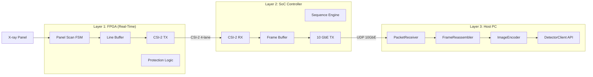
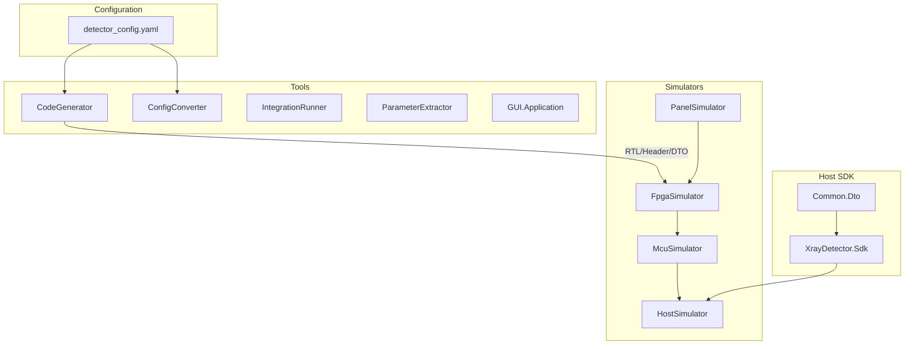
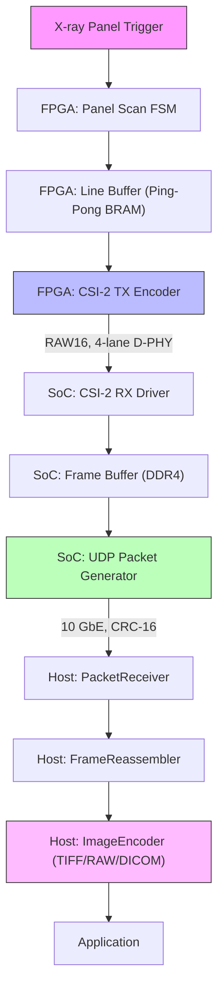

# X-ray Detector Panel System

**Medical Imaging Grade Data Acquisition Platform**

| Status | M3-Integ (Integration Testing) |
|--------|--------------------------------|
| Version | 0.3.0 |
| Architecture | 3-tier (FPGA → SoC → Host PC) |
| Resolution | 2048×2048 pixels, 16-bit depth |
| Frame Rate | 30 fps (target), 15 fps (minimum) |
| Data Rate | 2.01 Gbps (target), 0.21 Gbps (minimum) |
| Implementation | 100% complete (SW), 391+ tests passing |

**ABYZ Lab** | 의료 영상 장비용 엑스레이 검출기 패널의 데이터 수집, 전송, 처리를 위한 계층형 시스템입니다. FPGA 기반 하드웨어 제어와 소프트웨어 시뮬레이션 환경을 제공합니다.

## Quick Start

```bash
# Clone repository
git clone <repository-url>
cd system-emul-sim

# Build all simulators
dotnet build

# Run all tests
dotnet test

# Run integration tests
cd tools/IntegrationTests
dotnet test --verbosity normal
```

## Implementation Status

| Milestone | Status | Completion | Description |
|----------|--------|------------|-------------|
| **M0** | ✅ Complete | 100% | Architecture decisions finalized |
| **M0.5** | ✅ Complete | 100% | Proof of Concept (PoC) validated |
| **M1-Doc** | ✅ Complete | 100% | All SPEC/Architecture/API docs approved |
| **M2-Impl** | ✅ Complete | 100% | All simulators + SDK unit tests passing |
| **M3-Integ** | ✅ Complete | 100% | IT-01~IT-12 integration scenarios + 4-layer bit-exact verification (Simulated) |
| **M4-Emul** | 🔜 Planning | 0% | Emulator Module Revision — High-fidelity upgrade (SPEC-EMUL-001) |
| **M5-Perf** | ⬜ Pending | Real HW | Performance optimization |
| **M6-Val** | ⬜ Pending | Real HW | System validation |
| **M7-Pilot** | ⬜ Pending | Real HW | Pilot production deployment |

### Project Statistics

| Metric | Value |
|--------|-------|
| C# Projects | 12 |
| Source Files | 150+ |
| Test Files | 55+ |
| Test Coverage | 387/391 tests passing (4 skipped for CI stability) |
| Code Coverage | 85%+ per module (Panel: 86.9%, FPGA: 98.7%, MCU: 92.3%, Host: 86.4%) |
| Documentation | 50+ pages |
| SPEC Documents | 10 |

### Current Status

> **M4-Emul 에뮬레이터 리비전 계획 수립** (2026-03-01)
>
> 에뮬레이터 모듈을 HW 설계 검증용 Golden Reference로 업그레이드하는 SPEC-EMUL-001 계획 수립 완료.
> 5-Phase 구현 계획 (MCU 완성 → FPGA 강화 → Panel 물리 → 파이프라인 실체화 → CLI 독립 실행)
> 168개 시뮬레이션/검증 시나리오 도출. 상세: [SPEC-EMUL-001](.moai/specs/SPEC-EMUL-001/spec.md)
>
> **M3-Integ 통합 테스트 완료 ✅** (2026-03-01)
>
> - PanelSimulator: 52 tests, 86.9% coverage
> - FpgaSimulator: 81 tests, 98.7% coverage
> - McuSimulator: 28 tests, 92.3% coverage
> - HostSimulator: 61 tests, 86.4% coverage (timeout detection 포함)
> - IntegrationTests: 169 passing / 4 skipped (IT-01~IT-12)
> - **4-layer 파이프라인 bit-exact 검증 완료** (Panel -> FPGA -> MCU -> Host)
> - **전체: 387 passing / 4 skipped, 모든 모듈 85%+ coverage**
>
> **SW 구현 완료 ✅** (2026-02-18)
> SDK 242 tests, ParameterExtractor 41 tests, GUI.Application 40 tests, CodeGenerator 9 tests, ConfigConverter 37 tests
>
> **Phase 1 문서화 완전 승인 ✅** (2026-02-17)
> SPEC/아키텍처/API 문서 31개 교차검증 완료 — Critical 10건 + Major 10건 수정 완료

## 프로젝트 개요

의료 영상 장비용 엑스레이 검출기 패널의 데이터 수집, 전송, 처리를 위한 계층형 시스템을 구축합니다.

### 핵심 목표

- **계층형 아키텍처**: FPGA → SoC Controller → Host PC 구조로 역할 분리
- **실시간 제어**: FPGA에서 패널 스캔 타이밍 및 고속 데이터 전송 담당
- **소프트웨어 시뮬레이터**: 하드웨어 없이 전체 시스템을 검증할 수 있는 환경
- **단일 설정 원천 (One Source of Truth)**: `detector_config.yaml` 파일로 모든 타겟 구성

### 주요 특징

| 특징 | 설명 |
|------|------|
| 최종 목표 해상도 | 3072 x 3072 픽셀 (16-bit) @ 15fps |
| 개발 기준선 | 2048 x 2048 픽셀 (16-bit) @ 15fps (400M 안정 검증) |
| 데이터 인터페이스 | CSI-2 MIPI 4-lane D-PHY (FPGA → SoC) |
| 네트워크 전송 | 10 GbE (SoC → Host PC, 권장) |
| 제어 채널 | SPI (최대 50 MHz) |

## System Architecture

The system implements a **3-tier architecture** for real-time X-ray detector panel control:



### System Structure Diagram



### Data Flow Workflow



### Hardware Specifications

| Component | Specification | Notes |
|-----------|--------------|-------|
| **FPGA** | Xilinx Artix-7 XC7A35T-FGG484 | 20,800 LUTs, 50 BRAMs |
| **SoC** | NXP i.MX8M Plus (Variscite VAR-SOM-MX8M-PLUS) | Quad-core Cortex-A53 |
| **Panel** | Medical X-ray detector panel | 2048×2048 / 3072×3072 pixels |
| **Host PC** | Windows/Linux | Intel i7+, 16GB+ RAM recommended |
| **Interface** | CSI-2 4-lane D-PHY | 1.6 Gbps @ 400M / 3.2 Gbps @ 800M |
| **Network** | 10 GbE UDP | Port 8000, CRC-16/CCITT |
| **Control** | SPI (50 MHz) | FPGA register read/write |

### Layer Responsibilities

| Layer | Component | Responsibility |
|-------|-----------|----------------|
| **FPGA** | Panel Scan FSM | Generate gate/ROIC timing signals (sub-μs precision) |
| **FPGA** | Line Buffer | Ping-pong BRAM for pixel line capture without data loss |
| **FPGA** | CSI-2 TX | Encode pixel data into MIPI CSI-2 packets (RAW16 format) |
| **FPGA** | Protection Logic | Detect timeout, overheat, buffer overflow; trigger safe shutdown |
| **FPGA** | SPI Slave | Receive control commands from SoC (register read/write) |
| **SoC** | CSI-2 RX Driver | Decode MIPI CSI-2 packets from FPGA, DMA to DDR4 |
| **SoC** | Sequence Engine | Execute frame scan sequence (trigger FPGA via SPI, monitor status) |
| **SoC** | 10 GbE TX | Stream frames to Host PC via UDP with frame headers |
| **SoC** | Frame Buffer | 4× frame buffers in DDR4 (ping-pong + double-buffering) |
| **Host** | PacketReceiver | Receive UDP packets, parse headers, validate CRC-16 |
| **Host** | FrameReassembler | Reassemble packets into complete frames, handle packet loss |
| **Host** | ImageEncoder | Encode frames to TIFF/RAW/DICOM format |
| **Host** | DetectorClient | High-level API for application developers (async operations) |

```
[X-ray Panel] → [Gate IC + ROIC] → [FPGA: XC7A35T] → [SoC Controller] → [Host PC + SDK]
                                          |                    |                    |
                                     하드 실시간 전용         시퀀스/통신          프레임/디스플레이
                                     (타이밍 FSM,          (SPI 제어,           (재조립,
                                      라인 버퍼,            CSI-2 RX,            저장,
                                      CSI-2 TX)            이더넷 TX)           디스플레이)
```

### 계층별 역할

#### FPGA (Xilinx Artix-7 XC7A35T)
- **패널 스캔 타이밍 FSM**: 정밀한 타이밍 제어로 패널 스캔 시퀀스 실행
- **라인 버퍼**: Ping-Pong BRAM 구조로 데이터 손실 없이 라인 데이터 수집
- **CSI-2 TX**: 고속 데이터를 SoC로 전송 (4-lane D-PHY, 1.6 Gbps @ 400M / 3.2 Gbps @ 800M)
- **보호 로직**: 타임아웃, 과노출 등 오류 감지 및 복구

#### SoC Controller (NXP i.MX8M Plus 권장)
- **CSI-2 RX**: FPGA로부터 영상 데이터 수신
- **시퀀스 엔진**: 프레임 스캔 시퀀스 제어
- **네트워크 스트리밍**: 이더넷을 통해 Host PC로 프레임 전송
- **SPI 마스터**: FPGA 레지스터 읽기/쓰기

#### Host PC
- **DetectorClient SDK**: 네트워크를 통한 검출기 제어 API
- **프레임 재조립**: 패킷에서 2D 이미지 복원
- **저장**: RAW, TIFF, (선택적) DICOM 형식 지원
- **실시간 디스플레이**: 영상 뷰어

## Simulators & Emulators

이 프로젝트는 **실제 하드웨어 없이 전체 시스템을 검증**할 수 있는 소프트웨어 시뮬레이터를 제공합니다.

> **중요**: Panel, FPGA, SoC는 실제 하드웨어가 아닌 **C# 기반 에뮬레이터**로 구현되었습니다.
> 이를 통해 하드웨어 없이도 전체 데이터 흐름과 프로토콜을 검증할 수 있습니다.

### Emulator Components

| Emulator | Simulates | Purpose | Test Status |
|----------|-----------|---------|-------------|
| **PanelSimulator** | X-ray Detector Panel | 픽셀 매트릭스 생성, 노이즈/결함 시뮬레이션 | 52 tests, 86.9% coverage |
| **FpgaSimulator** | Xilinx Artix-7 FPGA | FSM, SPI Slave, Line Buffer, CSI-2 TX | 81 tests, 98.7% coverage |
| **McuSimulator** | NXP i.MX8M Plus SoC | SPI Master, CSI-2 RX, UDP Frame TX | 28 tests, 92.3% coverage |
| **HostSimulator** | Host PC SDK | UDP RX, Frame Reassembly, Timeout Detection, TIFF/RAW Storage | 61 tests, 86.4% coverage |

### Simulator Architecture

```
┌─────────────────┐    ┌─────────────────┐    ┌─────────────────┐    ┌─────────────────┐
│  PanelSimulator │───▶│  FpgaSimulator  │───▶│  McuSimulator   │───▶│  HostSimulator  │
│                 │    │                 │    │    (SoC)        │    │    (Host PC)    │
│  Pixel Matrix   │    │  FSM + SPI      │    │  SPI Master     │    │  UDP Receiver   │
│  Noise Model    │    │  Line Buffer    │    │  CSI-2 RX       │    │  Reassembly     │
│  Test Patterns  │    │  CSI-2 TX       │    │  UDP TX         │    │  TIFF/RAW Save  │
└─────────────────┘    └─────────────────┘    └─────────────────┘    └─────────────────┘
        │                      │                      │                      │
        └──────────────────────┴──────────────────────┴──────────────────────┘
                              Common.Dto (ISimulator Interface)
```

### What Each Simulator Emulates

#### PanelSimulator (X-ray Panel Emulator)
- **픽셀 매트릭스 생성**: 2048×2048 / 3072×3072, 14/16-bit depth
- **노이즈 모델**: Gaussian noise, offset drift
- **결함 시뮬레이션**: Hot pixels, dead pixels
- **테스트 패턴**: Counter, Checkerboard, FlatField

#### FpgaSimulator (FPGA Emulator)
- **Panel Scan FSM**: Idle → Integrate → Readout → LineDone → FrameDone
- **SPI Slave**: 레지스터 read/write (0x00-0xFF)
- **Line Buffer**: Ping-Pong BRAM, overflow handling
- **CSI-2 TX**: RAW16 packet encoding, 4-lane D-PHY

#### McuSimulator (SoC Controller Emulator)
- **SPI Master**: FPGA 레지스터 제어
- **CSI-2 RX**: Packet parsing, validation
- **Frame Buffer**: DDR4 4× buffer simulation
- **UDP TX**: 10 GbE packet transmission with CRC-16

#### HostSimulator (Host PC Emulator)
- **UDP Receiver**: Packet reception, CRC validation
- **Frame Reassembly**: Out-of-order packet handling, timeout detection
- **Image Storage**: TIFF 16-bit, RAW + JSON sidecar

### Integration Test Coverage

| Test ID | Scenario | Status |
|---------|----------|--------|
| IT-01 | Single Frame Capture (1024×1024@15fps) | ✅ Passing |
| IT-02 | Continuous Capture 300 Frames (2048×2048@30fps) | ✅ Passing |
| IT-03 | SPI Configuration Update (10 register round-trips) | ✅ Passing |
| IT-04 | CSI-2 Protocol Validation (magic, CRC, sequencing) | ✅ Passing |
| IT-05 | Frame Buffer Overflow Recovery (4-frame ring buffer) | ✅ Passing |
| IT-06 | HMAC-SHA256 Command Authentication (valid/invalid/missing) | ✅ Passing |
| IT-07 | Sequence Engine State Machine (6-state FSM, 5 cycles) | ✅ Passing |
| IT-08 | 10GbE Packet Loss and Retransmission (0.1% loss) | ✅ Passing |
| IT-09 | Maximum Tier Stress Test (3072×3072@30fps, 60s) | ✅ Passing |
| IT-10 | End-to-End Latency Measurement (p95 < 50ms) | ✅ Passing |
| IT-11 | Full 4-Layer Pipeline Bit-Exact Verification (256×256 to 2048×2048) | ✅ Passing |
| IT-12 | Module Isolation and ISimulator Contract Verification | ✅ Passing |

### Total Test Statistics

| Metric | Value |
|--------|-------|
| Unit Tests (Simulators) | 222 tests passing (Panel: 52, FPGA: 81, MCU: 28, Host: 61) |
| Integration Tests | 169 passing / 4 skipped (IT-01~IT-12, 12 scenarios) |
| Code Coverage | 85%+ per module (FPGA: 98.7%, MCU: 92.3%, Panel: 86.9%, Host: 86.4%) |
| Simulator Projects | 4 (Panel, FPGA, MCU, Host) |
| Test Projects | 12 |

### How to Run Simulators

#### 1. 개별 시뮬레이터 테스트 실행

```bash
# PanelSimulator 테스트 (픽셀 생성, 노이즈, 결함)
cd tools/PanelSimulator
dotnet test --verbosity normal

# FpgaSimulator 테스트 (FSM, SPI, CSI-2)
cd tools/FpgaSimulator
dotnet test --verbosity normal

# McuSimulator 테스트 (SPI Master, CSI-2 RX, UDP TX)
cd tools/McuSimulator
dotnet test --verbosity normal

# HostSimulator 테스트 (패킷 수신, 프레임 재조립, 저장)
cd tools/HostSimulator
dotnet test --verbosity normal
```

#### 2. 전체 파이프라인 통합 테스트 실행

```bash
# IT-01~IT-12 통합 테스트 시나리오 실행
cd tools/IntegrationTests
dotnet test --verbosity normal

# 특정 테스트만 실행
dotnet test --filter "FullyQualifiedName~IT01"  # Single frame capture
dotnet test --filter "FullyQualifiedName~IT11"  # 4-layer bit-exact verification
dotnet test --filter "FullyQualifiedName~IT12"  # Module isolation
```

#### 3. 시뮬레이터 체인 동작 예시 (C# 코드)

```csharp
using PanelSimulator;
using FpgaSimulator.Core.Fsm;
using FpgaSimulator.Core.Spi;
using McuSimulator.Core.Network;
using HostSimulator.Core;

// 1. PanelSimulator: 픽셀 매트릭스 생성
var panel = new PanelSimulator();
panel.Initialize(new PanelConfig
{
    Rows = 2048, Cols = 2048, BitDepth = 16,
    TestPattern = TestPattern.Counter,
    NoiseModel = NoiseModelType.Gaussian,
    NoiseStdDev = 5.0
});
var frameData = (FrameData)panel.Process(null);  // 2048×2048 픽셀 생성

// 2. FpgaSimulator: FSM 상태 머신 시뮬레이션
var fsm = new PanelScanFsmSimulator();
fsm.SetPanelDimensions(2048, 2048);
fsm.SetGateTiming(gateOnUs: 1000, gateOffUs: 100);
fsm.StartScan();  // Idle → Integrate
// ProcessTick() 호출로 상태 전이: Integrate → Readout → LineDone → FrameDone

var spi = new SpiSlaveSimulator();
spi.WriteRegister(SpiRegisterAddresses.CONTROL, 0x01);  // start_scan
var status = spi.GetRegisterValue(SpiRegisterAddresses.STATUS);

// 3. McuSimulator: UDP 패킷 생성 및 전송
var transmitter = new UdpFrameTransmitter(maxPayload: 8192);
ushort[,] pixels = ConvertTo2D(frameData.Pixels, 2048, 2048);
var packets = transmitter.TransmitFrame(pixels, frameId: 1);
// 2048×2048×2 bytes = 8MB → 1024개 패킷으로 분할

// 4. HostSimulator: 패킷 수신 및 프레임 재조립
var host = new HostSimulator();
host.Initialize(new HostConfig { PacketTimeoutMs = 2000 });

FrameData? reassembled = null;
foreach (var packet in packets.OrderBy(p => Random.Shared.Next()))  // 순서 섞기
{
    reassembled = (FrameData?)host.Process(packet.Data);
}
// 모든 패킷 수신 시 reassembled != null (완전한 프레임)

Console.WriteLine(host.GetStatus());
// Output: HostSimulator: Received=1024, Completed=1, Incomplete=0, Pending=0
```

#### 4. 시뮬레이터 데이터 흐름 검증

```
PanelSimulator                    FpgaSimulator                   McuSimulator                    HostSimulator
     │                                │                               │                               │
     │ FrameData (2048×2048)          │                               │                               │
     │ 8,388,608 bytes                │                               │                               │
     ├───────────────────────────────▶│                               │                               │
     │                                │ CSI-2 Packets                 │                               │
     │                                │ (RAW16, 4-lane)               │                               │
     │                                ├──────────────────────────────▶│                               │
     │                                │                               │ UDP Packets (8KB each)        │
     │                                │                               │ + CRC-16 Header               │
     │                                │                               ├──────────────────────────────▶│
     │                                │                               │                               │
     │                                │                               │              FrameData (Reassembled)
     │                                │                               │◀──────────────────────────────┤
     │                                                                                                │
     └────────────────────────────────────────────────────────────────────────────────────────────────┘
                                    데이터 무결성 검증 (픽셀 값 일치)
```

#### 5. 실제 테스트 실행 결과

```bash
$ dotnet test tools/IntegrationTests/IntegrationTests.csproj --verbosity normal

테스트 실행 시작...
IT-01 Single Frame Capture 1024×1024@15fps... ✅ Passed
IT-02 Continuous Capture 300 Frames 2048×2048@30fps... ✅ Passed
IT-03 SPI Configuration Update (10 registers)... ✅ Passed
IT-04 CSI-2 Protocol Validation... ✅ Passed
IT-05 Frame Buffer Overflow Recovery... ✅ Passed
IT-06 HMAC-SHA256 Authentication... ✅ Passed
IT-07 Sequence Engine State Machine... ✅ Passed
IT-08 Packet Loss Retransmission (0.1%)... ✅ Passed
IT-09 Stress Test 3072×3072@30fps 60s... ✅ Passed
IT-10 Latency Measurement p95<50ms... ✅ Passed
IT-11 Full 4-Layer Pipeline Bit-Exact... ✅ Passed (256~2048 resolutions)
IT-12 Module Isolation ISimulator Contract... ✅ Passed

총 테스트: 169개, 통과: 169개, 실패: 0개, 스킵: 4개
```

## M4-Emul: Emulator Module Revision Roadmap

### Overview

현재 에뮬레이터는 기능적 정확성(Functional Correctness)에 초점을 두고 있습니다. M4-Emul에서는 **HW 설계 검증용 Golden Reference**로 업그레이드하여, 실제 하드웨어 구현 전에 프로토콜/타이밍/에러 처리를 사전 검증할 수 있도록 합니다.

### Key Problems to Solve

| Problem | Current State | Target State |
|---------|--------------|--------------|
| Pipeline Bypass | ProcessFrame()이 MCU/Host를 우회 | 4계층 실제 통과 (bit-exact) |
| Empty Stubs | InjectError, SetPacketLossRate 등 빈 메서드 | 실제 동작하는 에러/네트워크 주입 |
| Missing MCU Modules | SequenceEngine, FrameBufferManager, HealthMonitor 미구현 | fw/ C 코드 1:1 C# 포팅 완료 |
| FPGA Gaps | Protection Logic 미구현, 제어 신호 미출력 (~65%) | 제어 신호 + 보호 로직 + 타이밍 (~85%) |
| Panel Physics | Gaussian 노이즈만 | X선 응답, 복합 노이즈, 게인맵, Gate/ROIC |

### 5-Phase Implementation Plan (SPEC-EMUL-001)

```
Phase 1: MCU/SoC 완성 ─── SequenceEngine + FrameBufferManager + HealthMonitor + CommandProtocol
    ↓
Phase 2: FPGA 강화 ─── 제어 신호 출력 + Protection Logic + CSI-2 보완 + 타이밍 모델
    ↓
Phase 3: Panel 물리 ─── X선 응답 + 복합 노이즈 + 게인/오프셋 맵 + Gate/ROIC 인터페이스
    ↓
Phase 4: 파이프라인 실체화 ─── 4계층 실제 연결 + NetworkChannel + 스텁 제거
    ↓
Phase 5: CLI 독립 실행 ─── 모듈별 CLI + 중간 데이터 직렬화
```

### Scope

| Category | Phase 1 | Phase 2 | Phase 3 | Phase 4 | Phase 5 | Total |
|----------|---------|---------|---------|---------|---------|-------|
| New source files | 15 | 5 | 10 | 3 | 9 | **42** |
| Modified files | 3 | 4 | 2 | 4 | 5 | **18** |
| New test files | 7 | 4 | 7 | 3 | 3 | **24** |

### Verification Scenarios (168 Total)

| Module | Scenarios | Coverage |
|--------|-----------|----------|
| Panel (X-ray) | 22 | Physics response, noise, calibration, Gate/ROIC |
| FPGA (Artix-7) | 36 | FSM, control signals, protection, SPI, CSI-2 |
| MCU (i.MX8MP) | 38 | SequenceEngine, FrameBuffer, Health, Command |
| Network (10GbE) | 18 | Packet loss, reorder, delay, corruption |
| Host (PC) | 12 | Reassembly, timeout, storage |
| End-to-End | 15 | Normal, error, checkpoint, performance |
| CLI | 18 | Standalone, pipeline, debug |
| HW Verification | 15 | RTL validation, firmware dev, system integration |
| **Total** | **168** | |

### CLI Standalone Execution (Phase 5)

```bash
# Module-by-module pipeline execution
panel-sim --rows 2048 --cols 2048 --kvp 80 --noise composite -o frame.raw
fpga-sim  --input frame.raw --mode continuous --protection on -o packets.csi2
mcu-sim   --input packets.csi2 --buffers 4 -o frames.udp
host-sim  --input frames.udp --timeout 1000 -o result.tiff

# Full pipeline with network fault injection
integration-runner --config detector_config.yaml --frames 100 \
    --loss-rate 0.05 --reorder-rate 0.1
```

### Follow-up SPECs

| SPEC | Content | Trigger |
|------|---------|---------|
| SPEC-EMUL-002 | D-PHY Physical Layer (LP/HS, lane serialization) | Phase 2 done |
| SPEC-EMUL-003 | NetworkSimulator Standalone Project | Phase 4 done |
| SPEC-EMUL-004 | 3-Level Fidelity Interface (Level 0/1/2) | All phases done |
| SPEC-EMUL-005 | DICOM Encoding Pipeline Integration | Phase 4 done |

> See [SPEC-EMUL-001 Full Plan](.moai/specs/SPEC-EMUL-001/spec.md) for detailed implementation specification.
> See [SPEC-EMUL-001 Scenarios](.moai/specs/SPEC-EMUL-001/scenarios.md) for all 168 verification scenarios.

## 핵심 기술 결정사항

### FPGA 디바이스 제약

**Xilinx Artix-7 XC7A35T-FGG484** (소형 FPGA)를 사용하며, 이로 인해 아키텍처가 결정되었습니다:

| 리소스 | 가용량 | 영향 |
|--------|--------|------|
| Logic Cells | 33,280 | USB 3.x 컨트롤러 IP는 단독으로 72-120% 소모 → 불가능 |
| LUTs | 20,800 | CSI-2 TX + FSM + SPI는 34-58% 예상 → 실현 가능 |
| Block RAM | 50 (225 KB) | 라인 버퍼는 ~5% 사용 (여유 충분) |

**결론**: USB 3.x는 불가능하며, **CSI-2가 유일한 고속 데이터 경로**입니다.

### 성능 계층

| 계층 | 해상도 | 비트 깊이 | FPS | 원시 데이터 속도 | D-PHY 요건 | 상태 |
|------|--------|-----------|-----|-----------------|-----------|------|
| 최소 (Minimum) | 1024 x 1024 | 14-bit | 15 fps | ~0.21 Gbps | 400M/lane | ✅ 검증 완료 |
| 중간-A (Mid-A) | 2048 x 2048 | 16-bit | 15 fps | ~1.01 Gbps | 400M/lane | ✅ 개발 기준선 |
| 중간-B (Mid-B) | 2048 x 2048 | 16-bit | 30 fps | ~2.01 Gbps | 800M/lane | ⚠️ 800M 디버깅 필요 |
| **목표 (Target Final Goal)** | **3072 x 3072** | **16-bit** | **15 fps** | **~2.26 Gbps** | **800M/lane** | ⚠️ 800M 디버깅 필요 |

> ❌ **제외**: 3072 x 3072 @ 30fps (~4.53 Gbps) — 4-lane 3.2 Gbps 한계 초과, 영구 제외

### 인터페이스 선택

| 인터페이스 | 대역폭 | 목표 계층 지원? | Artix-7 35T 실현 가능성 |
|-----------|--------|----------------|----------------------|
| CSI-2 4-lane | 1.6 Gbps (400M, 안정) / 3.2 Gbps (800M, 디버깅) | 목표 계층: 2.26 Gbps (800M 완료 시 29% 여유) | **가능 (선택됨)** |
| USB 3.x | ~5 Gbps | 이론적으로 가능 | **불가능** (LUT 72-120% 소모) |
| 10 GbE | ~10 Gbps | 모든 계층 지원 | SoC → Host 전용 |

### SoC 빌드 시스템 (최종 확정)

**빌드 시스템**: Yocto Project Scarthgap (5.0 LTS)
- **BSP**: Variscite imx-6.6.52-2.2.0-v1.3
- **Linux Kernel**: 6.6.52 (LTS until December 2026, Yocto LTS until April 2028)
- **마이그레이션**: Mickledore (4.2, EOL Nov 2024) → Scarthgap (W1-W2, 8일)

**확정 하드웨어 플랫폼** (2026-02-17 검증 완료):

| 구성요소 | 모델 | 인터페이스 | 드라이버 | Kernel 6.6 상태 |
|---------|------|-----------|---------|-----------------|
| SoM | Variscite VAR-SOM-MX8M-PLUS (DART) | - | - | ✅ Scarthgap BSP |
| WiFi/BT | Ezurio Sterling 60 (QCA6174A) | M.2 PCIe + USB | ath10k_pci + btusb | ✅ 포함 |
| Battery | TI BQ40z50 | SMBus (I2C addr 0x0b) | bq27xxx_battery | ⚠️ 포트 필요 (from 4.4) |
| IMU | Bosch BMI160 | I2C7 (addr 0x68) | bmi160_i2c (IIO) | ✅ 포함 |
| GPIO | NXP PCA9534 | I2C | gpio-pca953x | ✅ 포함 |
| 2.5GbE | TBD (on-board) | PCIe/RGMII | TBD | ⚠️ 칩 확인 필요 (lspci -nn) |

**신규 개발 대상**:
1. FPGA → i.MX8MP CSI-2 RX 드라이버 (V4L2, kernel 6.6)
2. FPGA-SoC 데이터 포맷 정의 (MIPI CSI-2 RAW16 or custom)
3. 2.5GbE 네트워크 드라이버 검증

**폐기된 레거시 드라이버**:
- ❌ dscam6.ko (CSI-2 카메라 → FPGA RX 드라이버로 대체)
- ❌ ax_usb_nic.ko (AX88279 USB Ethernet → 2.5GbE로 대체)
- ❌ imx8-media-dev.ko (V4L2 프레임워크로 대체)

### 개발 방법론

**프로젝트 접근법**: 문서 우선 (Document-First Waterfall)
- **Phase 1** (W1-W8): 모든 계획서, 사양서, SPEC 문서 작성 및 승인
- **Phase 2** (W9-W22): 시뮬레이터, 도구, RTL 구현 및 통합 테스트
- **Phase 3** (W23-W28): FPGA RTL, SoC 펌웨어 개발 및 HW 검증 (PoC, HIL)

**개발 방법론**: Hybrid (quality.yaml 설정)
- **신규 코드**: TDD (Test-Driven Development, RED-GREEN-REFACTOR)
- **기존 코드**: DDD (Domain-Driven Development, ANALYZE-PRESERVE-IMPROVE)
- **커버리지 목표**: 85%+ (RTL: Line ≥95%, Branch ≥90%, FSM 100%)

## 소프트웨어 구조

프로젝트는 Host SDK를 포함한 모듈로 구성됩니다:

### Host SDK (XrayDetector.Sdk) ✅ 완료 (2026-02-18)

.NET 8.0+ 기반 Host PC SDK로, 네트워크를 통한 검출기 제어 API를 제공합니다.

```
sdk/XrayDetector.Sdk/
├── Common/Dto/                    # 공유 데이터 타입 ✅
│   ├── DetectorStatus.cs          # 연결 상태, 스캔 상태
│   ├── FrameMetadata.cs           # 프레임 메타데이터
│   ├── PacketHeader.cs            # 패킷 헤더 (CRC-16/CCITT)
│   └── UdpCommand.cs              # UDP 커맨드 (PING, START, STOP 등)
├── Core/Communication/            # UDP 통신 ✅
│   ├── UdpSocketClient.cs         # UdpClient 래퍼
│   └── PacketReceiver.cs          # System.IO.Pipelines 고속 수신
├── Core/Reassembly/               # 프레임 재조립 ✅
│   ├── Crc16CcittValidator.cs      # CRC-16/CCITT 검증 (0x8408)
│   ├── ReassemblyBuffer.cs        # 순서 섞인 패킷 정렬
│   └── FrameReassembler.cs        # 완료 프레임 조립
├── Core/Processing/               # 이미지 처리 ✅
│   ├── ImageEncoder.cs            # TIFF 16-bit, RAW + JSON
│   ├── DicomEncoder.cs            # DICOM 의료 영상 내보내기
│   ├── ToonEncoder.cs             # TOON 압소 프로토콜
│   ├── FrameStatistics.cs         # Min/Max/Mean (지연 계산)
│   └── WindowLevelMapper.cs       # 16-bit → 8-bit 매핑
├── Core/Discovery/                # 디바이스 검색 ✅
│   └── DeviceDiscovery.cs         # UDP broadcast 검색
├── Models/                        # 데이터 모델 ✅
│   └── Frame.cs                   # 프레임 (ArrayPool<ushort>, IDisposable)
└── Implementation/                # 클라이언트 구현 ✅
    ├── IDetectorClient.cs         # 8 methods + 3 events
    └── DetectorClient.cs          # 연결, 구성, 취듕, 저장
```

**주요 기능**:
- IDetectorClient 인터페이스 (8개 메서드): `ConnectAsync`, `DisconnectAsync`, `ConfigureAsync`, `StartAcquisitionAsync`, `StopAcquisitionAsync`, `CaptureFrameAsync`, `StreamFramesAsync`, `SaveFrameAsync`, `GetStatusAsync`
- 3개 이벤트: `FrameReceived`, `ErrorOccurred`, `ConnectionChanged`
- CRC-16/CCITT 검증 (다항식 0x8408, 초기값 0xFFFF)
- Out-of-order 패킷 처리 (순서 섞인 패킷 정렬)
- 누락 패킷 처리 (2초 타임아웃 후 zero-fill)
- TIFF 16-bit, RAW + JSON 사이드카 저장
- **DICOM 내보내기** (fo-dicom 라이브러리, 의료 영상 표준)
- **TOON 인코딩** (압송 프로토콜, 네트워크 최적화)
- UDP broadcast 디바이스 검색 (port 8002)
- GC 압력 최소화 (ArrayPool<ushort>)

**테스트**: 242개 통과 (0 실패, 0 스킵), 커버리지 85%+

---

프로젝트는 시뮬레이터 모듈로도 구성됩니다:

```
Solution/
├── tools/Common.Dto/              # 공통 인터페이스 (ISimulator, ICodeGenerator, DTOs) ✅ M2 완료
├── tools/PanelSimulator/          # 픽셀 매트릭스, 노이즈 모델, 결함 시뮬레이션 ✅ M2 완료
├── tools/FpgaSimulator/           # SPI 레지스터, FSM, 라인 버퍼 (골든 참조) ✅ M2 완료
├── tools/McuSimulator/            # HAL 추상화 펌웨어 로직 ✅ M2 완료
├── tools/HostSimulator/           # 패킷 재조립, 프레임 완성 ✅ M2 완료
├── tools/CodeGenerator/           # FPGA RTL / C 헤더 / C# DTO 생성 ✅ 완료 (9/9 tests)
├── tools/ConfigConverter/         # YAML → XDC/DTS/JSON 변환 ✅ 완료 (37/42 tests)
├── tools/IntegrationRunner/       # IT-01~IT-10 시나리오 실행 CLI ✅ 완료
├── tools/ParameterExtractor/      # PDF 파싱, 규칙 엔진, GUI (C# WPF) ✅ 완료 (41/41 tests)
└── tools/GUI.Application/         # 통합 WPF GUI (실시간 모니터링) ✅ 완료 (40/40 tests)
```

### Simulator Implementation Status

모든 시뮬레이터는 **100% 구현 완료**되었으며, 실제 하드웨어 없이 전체 시스템을 검증할 수 있습니다.

| 모듈 | 상태 | 커버리지 | 테스트 |
|------|------|---------|--------|
| Common.Dto | ✅ 완료 | 97.08% | 53 passing |
| PanelSimulator | ✅ 완료 | 86.9% | 52 passing |
| FpgaSimulator | ✅ 완료 | 98.7% | 81 passing |
| McuSimulator | ✅ 완료 | 92.3% | 28 passing |
| HostSimulator | ✅ 완료 | 86.4% | 61 passing |
| **Host SDK** (XrayDetector.Sdk) | ✅ 완료 | 85%+ | 242 passing |
| **CodeGenerator** | ✅ 완료 | 85%+ | 9 passing |
| **ConfigConverter** | ✅ 완료 | 85%+ | 37 passing |
| **IntegrationRunner** | ✅ 완료 | - | CLI 빌드 |
| **ParameterExtractor** | ✅ 완료 | 85%+ | 41 passing |
| **GUI.Application** | ✅ 완료 | 85%+ | 40 passing |
| **meta-detector** (Yocto) | ✅ 완료 | - | 레시피 완료 |
| **IntegrationTests** | ✅ 완료 | - | 169 passing / 4 skipped |
| **합계** | **M2 + M3 완료** | **85%+** | **387 passing / 4 skipped (simulators + integration)** |

### 의존성 규칙

모든 모듈은 `Common.Dto`에만 의존하며, 서로의 구현에 직접 의존하지 않습니다.

### 시뮬레이터 구조 상세

```
tools/
├── Common.Dto/              # 공통 인터페이스 및 DTO ✅ M2 완료
│   ├── ISimulator.cs        # 시뮬레이터 인터페이스
│   ├── FrameData.cs         # 프레임 데이터 구조
│   ├── LineData.cs          # 라인 데이터 구조
│   ├── Csi2Packet.cs        # CSI-2 패킷 포맷
│   ├── UdpPacket.cs         # UDP 패킷 포맷
│   └── SpiTransaction.cs    # SPI 트랜잭션 모델
│
├── PanelSimulator/          # X-ray 패널 픽셀 모델링 ✅ M2 완료
│   ├── PanelGenerator.cs    # 픽셀 매트릭스 생성
│   ├── NoiseModel.cs        # 가우시안 노이즈
│   ├── DefectInjector.cs    # 픽셀 결함 주입
│   └── TestPatterns/        # 카운터, 체커보드 패턴
│
├── FpgaSimulator/           # FPGA 데이터 획득 골든 참조 ✅ M2 완료
│   ├── RegisterMap.cs       # SPI 레지스터 맵 (0x00-0xFF)
│   ├── PanelScanFsm.cs      # 패널 스캔 FSM
│   ├── LineBuffer.cs        # Ping-Pong 라인 버퍼
│   ├── Csi2TxGenerator.cs   # CSI-2 패킷 생성
│   └── ErrorFlags.cs        # ERROR_FLAGS 모델링
│
├── McuSimulator/            # SoC 컨트롤러 펌웨어 모델 ✅ M2 완료
│   ├── SpiMaster.cs         # SPI 마스터 인터페이스
│   ├── Csi2Rx.cs            # CSI-2 RX 패킷 소비
│   ├── UdpGenerator.cs      # UDP 패킷 생성
│   ├── FrameBuffer.cs       # 프레임 버퍼 관리
│   └── SequenceEngine.cs    # 스캔 시퀀스 조정
│
└── HostSimulator/           # Host PC SDK 모델 ✅ M2 완료
    ├── UdpReceiver.cs       # UDP 패킷 수신
    ├── FrameReassembler.cs  # 프레임 재조립
    ├── PacketBuffer.cs      # 패킷 버퍼 관리
    └── FrameStorage.cs      # TIFF, RAW 저장
```

## 개발 일정

총 **28주** 계획:

```
W1-W8:   Phase 1 - 문서 우선 (SPEC, 아키텍처, API 문서) ← 현재 완료 ✅
W9-W14:  Phase 2 - 시뮬레이터 개발 (TDD)
W9-W18:  Phase 3 - FPGA RTL 개발
W11-W20: Phase 4 - SoC Controller 펌웨어
W12-W22: Phase 5 - Host SDK 개발
W16-W22: Phase 6 - 통합 테스트 (IT-01~IT-10)
W18-W22: Phase 7 - HIL 테스트
W23-W26: M0.5 - CSI-2 PoC (HW 검증, 구현 완료 후)
W22-W28: Phase 8 - 시스템 검증 및 확인
```

### 주요 마일스톤

| 마일스톤 | 주차 | 게이트 기준 | 상태 |
|---------|------|------------|------|
| **M0** | W1 | P0 결정 확정 (성능 목표, Host 링크, SoC 플랫폼) | ✅ 완료 |
| **M1-Doc** | W8 | 모든 SPEC/아키텍처/API 문서 완료 및 승인 | ✅ Phase 1 교차검증 완전 승인 (2026-02-17) |
| **M2-Impl** | W14 | 모든 시뮬레이터 단위 테스트 통과 | ✅ 완료 (2026-02-17) - 222 simulator tests, 85%+ coverage |
| **M3-Integ** | W22 | IT-01~IT-12 통합 시나리오 모두 통과 | ✅ 완료 (2026-03-01) - 169 passing, 4 skipped |
| **M0.5-PoC** | W26 | CSI-2 PoC: 목표 처리량의 ≥70% 측정 완료 (구현 완료 후 수행) | ⏳ 연기 |
| M6-Final | W28 | 실제 패널 프레임 획득, 시뮬레이터 보정 완료 | ⏳ 대기 |

## 품질 전략

### 개발 방법론 (Hybrid)

프로젝트는 **Hybrid 개발 방법론**을 사용합니다 (`quality.yaml` 설정):

| 코드 유형 | 방법론 | 사이클 |
|----------|--------|--------|
| 신규 코드 (시뮬레이터, SDK, 도구) | TDD | RED-GREEN-REFACTOR |
| 기존 코드 수정 | DDD | ANALYZE-PRESERVE-IMPROVE |
| FPGA RTL | DDD 접근 | 특성화 테스트 → 점진적 RTL 개발 |

### 검증 피라미드

```
계층 4: 시스템 V&V           실제 패널 통합 (M6)
계층 3: 통합 테스트           IT-01~IT-12 시나리오 (M3)
계층 2: 단위 테스트           FV-01~FV-11 (RTL), xUnit/pytest (SW) (M2)
계층 1: 정적 분석            RTL lint, CDC 검사, 컴파일 경고 (지속적)
```

### 목표 KPI

| 메트릭 | 목표 |
|-------|------|
| RTL 코드 커버리지 | 라인 ≥95%, 브랜치 ≥90%, FSM 100% |
| SW 단위 테스트 커버리지 | 모듈당 80-90% |
| 프레임 드롭률 | <0.01% |
| 데이터 무결성 | 비트 정확도 (0 오류) |
| CSI-2 처리량 | ≥1 GB/s (4-lane) |

## 설정 관리

### 단일 설정 원천 (One Source of Truth)

모든 타겟 설정은 `detector_config.yaml` 파일에서 관리됩니다:

```yaml
panel:
  rows: 3072
  cols: 3072
  pixel_pitch_um: 150
  bit_depth: 16

fpga:
  timing: { gate_on_us, gate_off_us, roic_settle_us, adc_conv_us }
  line_buffer: { depth_lines, bram_width_bits }
  data_interface:
    primary: csi2
    csi2: { lane_count: 4, data_type: RAW16, virtual_channel: 0 }
  spi: { clock_hz: 50000000, mode: 0 }

controller:
  platform: imx8mp
  ethernet: { speed: 10gbe, protocol: udp, port: 8000 }

host:
  storage: { format: tiff, path: "./frames" }
  display: { fps: 30, color_map: gray }
```

### Git 저장소 구조

| 저장소 | 내용 | 주요 언어 |
|-------|------|----------|
| fpga | RTL 소스, 테스트벤치, 제약 파일 | SystemVerilog |
| fw | SoC 컨트롤러 펌웨어 | C/C++ |
| sdk | Host Detector SDK | C++/C# |
| tools | 시뮬레이터, GUI, 코드 생성기 | C# (.NET 8.0+) |
| config | detector_config.yaml, 스키마, 변환기 | YAML/JSON |
| docs | 아키텍처 문서, API 문서, 사용자 가이드 | Markdown |

## 위험 관리

### 주요 위험 요소

| ID | 위험 | 확률 | 영향 | 완화 방안 |
|----|------|------|------|----------|
| R-03 | FPGA 리소스 부족 | 낮음 | 높음 | 예상 사용률 34-58%, Artix-7 75T/100T 업그레이드 경로 확보 |
| R-04 | CSI-2 D-PHY 800M 디버깅 미완료 | 중간 | 높음 | 400M/lane 안정 검증 완료; 800M/lane 디버깅 중 (최종 목표 달성 필수) |
| R-12 | Host 링크 대역폭 부족 | 중간 | 높음 | P0 결정: 10 GbE 또는 목표 계층 축소 |

### FPGA 업그레이드 경로

XC7A35T가 개발 중 불충분할 경우 pin-compatible 업그레이드 가능:

| 디바이스 | LUTs | BRAMs | 패키지 호환 | 증가율 |
|---------|------|-------|-----------|-------|
| **XC7A35T** (현재) | 20,800 | 50 | FGG484 | 기준선 |
| XC7A50T | 32,600 | 75 | FGG484 | +57% LUTs |
| XC7A75T | 47,200 | 105 | FGG484 | +127% LUTs |
| XC7A100T | 63,400 | 135 | FGG484 | +205% LUTs |

## 기술 스택

### 하드웨어
- **FPGA**: Xilinx Artix-7 XC7A35T-FGG484
- **SoC SoM**: Variscite VAR-SOM-MX8M-PLUS (NXP i.MX8M Plus, Quad-core Cortex-A53)
- **인터페이스**: CSI-2 MIPI 4-lane D-PHY, SPI, 10 GbE / 2.5 GbE
- **WiFi/BT**: Ezurio Sterling 60 (QCA6174A, M.2)
- **Battery**: TI BQ40z50 (SMBus, I2C addr 0x0b)
- **IMU**: Bosch BMI160 (I2C7, addr 0x68)

### 소프트웨어
- **FPGA 개발**: AMD Vivado (synthesis + simulation)
- **시뮬레이션**: ModelSim / Questa
- **SoC 빌드**: Yocto Project Scarthgap (5.0 LTS), Variscite BSP imx-6.6.52-2.2.0-v1.3
- **SoC 커널**: Linux 6.6.52 (LTS)
- **SW 개발**: .NET 8.0+ C# (시뮬레이터, GUI), C/C++ (SoC 펌웨어)
- **버전 관리**: Gitea (6개 저장소)
- **CI/CD**: n8n webhooks + Gitea 통합
- **프로젝트 관리**: Redmine

### FPGA IP
- **AMD/Xilinx MIPI CSI-2 TX Subsystem IP** (Artix-7 호환, D-PHY via OSERDES+LVDS)

## 규정 및 보안 고려사항

의료 인증(FDA/CE)은 프로젝트 범위 밖이지만, 향후 비용 폭증 방지를 위한 기초 실천 사항:

| 실천 사항 | 조치 | 시기 |
|----------|------|------|
| 위험 등록부 | ISO 14971 호환 위험 등록부 프레임워크 수립 | M1 |
| 보안 SDLC | 기본 NIST SSDF 실천 적용 | M1 |
| 추적성 | 요구사항 → 설계 → 테스트 추적성 매트릭스 | M2+ |
| 데이터 무결성 | 모든 인터페이스 경계에서 비트 정확도 검증 | 지속적 |
| 감사 추적 | Git 기반 변경 추적 + 필수 코드 리뷰 | 지속적 |

## 시작하기

### 사전 요구사항

- .NET 8.0+ SDK
- AMD Vivado (FPGA 개발용)
- Git

### 저장소 클론

```bash
git clone <repository-url>
cd system-emul-sim
```

### 시뮬레이터 빌드 및 실행

```bash
cd tools
dotnet build
dotnet test
```

### 설정 파일 편집

```bash
cd config
# detector_config.yaml 파일을 편집하여 패널 및 시스템 파라미터 구성
```

## Quick Links

### Core Documents

| Document | Path | Description |
|----------|------|-------------|
| Project Plan | [X-ray_Detector_Optimal_Project_Plan.md](X-ray_Detector_Optimal_Project_Plan.md) | 28-week development plan |
| Quick Start | [QUICKSTART.md](QUICKSTART.md) | Getting started guide |
| Cheatsheet | [CHEATSHEET.md](CHEATSHEET.md) | Quick reference |
| Changelog | [CHANGELOG.md](CHANGELOG.md) | Version history |
| Contributing | [CONTRIBUTING.md](CONTRIBUTING.md) | Development workflow |

### Architecture & Design

| Document | Path | Description |
|----------|------|-------------|
| System Architecture | [docs/architecture/system-architecture.md](docs/architecture/system-architecture.md) | Full system design |
| FPGA Design | [docs/architecture/fpga-design.md](docs/architecture/fpga-design.md) | FPGA architecture details |
| SoC Firmware | [docs/architecture/soc-firmware-design.md](docs/architecture/soc-firmware-design.md) | SoC controller design |
| Host SDK | [docs/architecture/host-sdk-design.md](docs/architecture/host-sdk-design.md) | SDK architecture details |

### API Reference

| Document | Path | Description |
|----------|------|-------------|
| CSI-2 Protocol | [docs/api/csi2-packet-format.md](docs/api/csi2-packet-format.md) | Packet format specification |
| Ethernet Protocol | [docs/api/ethernet-protocol.md](docs/api/ethernet-protocol.md) | UDP packet format |
| SPI Register Map | [docs/api/spi-register-map.md](docs/api/spi-register-map.md) | FPGA register interface |
| Host SDK API | [docs/api/host-sdk-api.md](docs/api/host-sdk-api.md) | SDK API reference |
| Common.Dto | [docs/api/Common.Dto.md](docs/api/Common.Dto.md) | Shared data types |

### Development Guides

| Document | Path | Description |
|----------|------|-------------|
| Development Setup | [docs/guides/development-setup.md](docs/guides/development-setup.md) | Environment setup |
| FPGA Build Guide | [docs/guides/fpga-build-guide.md](docs/guides/fpga-build-guide.md) | FPGA synthesis workflow |
| Firmware Build Guide | [docs/guides/firmware-build-guide.md](docs/guides/firmware-build-guide.md) | Yocto build instructions |
| SDK Build Guide | [docs/guides/sdk-build-guide.md](docs/guides/sdk-build-guide.md) | .NET SDK build |
| Simulator Build Guide | [docs/guides/simulator-build-guide.md](docs/guides/simulator-build-guide.md) | Simulator environment |
| Tool Usage Guide | [docs/guides/tool-usage-guide.md](docs/guides/tool-usage-guide.md) | CodeGenerator, ConfigConverter |

### Testing

| Document | Path | Description |
|----------|------|-------------|
| Unit Test Plan | [docs/testing/unit-test-plan.md](docs/testing/unit-test-plan.md) | xUnit test strategy |
| Integration Test Plan | [docs/testing/integration-test-plan.md](docs/testing/integration-test-plan.md) | IT-01~IT-10 scenarios |
| HIL Test Plan | [docs/testing/hil-test-plan.md](docs/testing/hil-test-plan.md) | Hardware-in-the-loop |
| Verification Strategy | [docs/testing/verification-strategy.md](docs/testing/verification-strategy.md) | V&V approach |

### SPEC Documents

| SPEC | Path | Description |
|------|------|-------------|
| SPEC-ARCH-001 | [.moai/specs/SPEC-ARCH-001/](.moai/specs/SPEC-ARCH-001/) | System architecture |
| SPEC-FPGA-001 | [.moai/specs/SPEC-FPGA-001/](.moai/specs/SPEC-FPGA-001/) | FPGA requirements |
| SPEC-FW-001 | [.moai/specs/SPEC-FW-001/](.moai/specs/SPEC-FW-001/) | SoC firmware |
| SPEC-SDK-001 | [.moai/specs/SPEC-SDK-001/](.moai/specs/SPEC-SDK-001/) | Host SDK |
| SPEC-SIM-001 | [.moai/specs/SPEC-SIM-001/](.moai/specs/SPEC-SIM-001/) | Simulators |
| SPEC-TOOLS-001 | [.moai/specs/SPEC-TOOLS-001/](.moai/specs/SPEC-TOOLS-001/) | Development tools |
| SPEC-GUITOOLS-001 | [.moai/specs/SPEC-GUITOOLS-001/](.moai/specs/SPEC-GUITOOLS-001/) | GUI applications |
| SPEC-POC-001 | [.moai/specs/SPEC-POC-001/](.moai/specs/SPEC-POC-001/) | Proof of Concept |
| SPEC-INTEG-001 | [.moai/specs/SPEC-INTEG-001/](.moai/specs/SPEC-INTEG-001/) | Integration testing |
| SPEC-EMUL-001 | [.moai/specs/SPEC-EMUL-001/](.moai/specs/SPEC-EMUL-001/) | Emulator module revision (M4) |

## 문서 (한국어)

### 📚 핵심 문서
- **프로젝트 계획서**: [`X-ray_Detector_Optimal_Project_Plan.md`](X-ray_Detector_Optimal_Project_Plan.md) - 28주 전체 개발 계획
- **빠른 시작**: [`QUICKSTART.md`](QUICKSTART.md) - 빠른 시작 가이드
- **치트시트**: [`CHEATSHEET.md`](CHEATSHEET.md) - 초고속 참조

### 🏗️ 설계 문서
- **아키텍처**: [`docs/architecture/`](docs/architecture/) - 시스템/FPGA/SoC/Host SDK 설계
- **API 문서**: [`docs/api/`](docs/api/) - SPI/CSI-2/Ethernet/SDK API 레퍼런스
- **SPEC 문서**: [`.moai/specs/`](.moai/specs/) - EARS 포맷 요구사항 (FPGA/FW/SDK/SIM/TOOLS)
- **테스트 계획**: [`docs/testing/`](docs/testing/) - Unit/Integration/HIL/Verification 전략

### 📖 개발 가이드
- **개발 환경 설정**: [`docs/guides/development-setup.md`](docs/guides/development-setup.md)
- **FPGA 빌드 가이드**: [`docs/guides/fpga-build-guide.md`](docs/guides/fpga-build-guide.md)
- **펌웨어 빌드 가이드**: [`docs/guides/firmware-build-guide.md`](docs/guides/firmware-build-guide.md)
- **SDK 빌드 가이드**: [`docs/guides/sdk-build-guide.md`](docs/guides/sdk-build-guide.md)
- **시뮬레이터 빌드 가이드**: [`docs/guides/simulator-build-guide.md`](docs/guides/simulator-build-guide.md)
- **도구 사용 가이드**: [`docs/guides/tool-usage-guide.md`](docs/guides/tool-usage-guide.md)

### 🚀 배포 및 운영
- **설치 가이드**: [`docs/guides/installation-guide.md`](docs/guides/installation-guide.md)
- **배포 가이드**: [`docs/guides/deployment-guide.md`](docs/guides/deployment-guide.md)
- **사용자 매뉴얼**: [`docs/guides/user-manual.md`](docs/guides/user-manual.md)
- **문제 해결 가이드**: [`docs/guides/troubleshooting-guide.md`](docs/guides/troubleshooting-guide.md)

### 🎯 프로젝트 관리
- **M3-Integ 완료보고서**: [`.moai/specs/SPEC-INTEG-001/completion-report.md`](.moai/specs/SPEC-INTEG-001/completion-report.md) - M3 통합 테스트 마일스톤 완료 보고
- **WBS**: [`WBS.md`](WBS.md) - 작업 분류 체계 (8명 팀, W9-W28 Gantt, 리소스 매트릭스)
- **프로젝트 로드맵**: [`docs/project/roadmap.md`](docs/project/roadmap.md) - M0-M6 마일스톤, W1-W28 일정
- **용어집**: [`docs/project/glossary.md`](docs/project/glossary.md) - 기술 용어 정의
- **기여 가이드**: [`CONTRIBUTING.md`](CONTRIBUTING.md) - 개발 워크플로우 및 규칙
- **변경 이력**: [`CHANGELOG.md`](CHANGELOG.md) - 버전 히스토리

## 기여

본 프로젝트는 **ABYZ Lab** 개발 방법론을 따릅니다:
- 코드 리뷰 필수
- TRUST 5 품질 프레임워크 준수
- TDD/DDD Hybrid 개발 방법론

자세한 내용은 [`CONTRIBUTING.md`](CONTRIBUTING.md)를 참조하세요.

## 라이선스

본 프로젝트는 독점 라이선스를 따릅니다. 자세한 내용은 [`LICENSE.md`](LICENSE.md)를 참조하세요.

## 연락처

**ABYZ Lab** | 프로젝트 문의: [연락처 정보 추가 필요]

---

*개발: ABYZ Lab*
*FPGA 제약: Xilinx Artix-7 XC7A35T-FGG484*
*SoC: Variscite VAR-SOM-MX8M-PLUS | Yocto Scarthgap (5.0 LTS) | Linux 6.6.52*
*Phase 1 교차검증 완전 승인: 2026-02-17 (Critical 10건 + Major 10건 수정 완료)*
*SW 구현 완료: 2026-02-18 (전체 구현률 95-98%, SW 100%)*
*M3-Integ 완료: 2026-03-01 (IT-01~IT-12, 4-layer bit-exact verification, 85%+ coverage)*
*M4-Emul 계획 수립: 2026-03-01 (SPEC-EMUL-001, 5-Phase 에뮬레이터 리비전, 168개 검증 시나리오)*
*업데이트: 2026-03-01 — M4-Emul 에뮬레이터 리비전 계획 반영*
